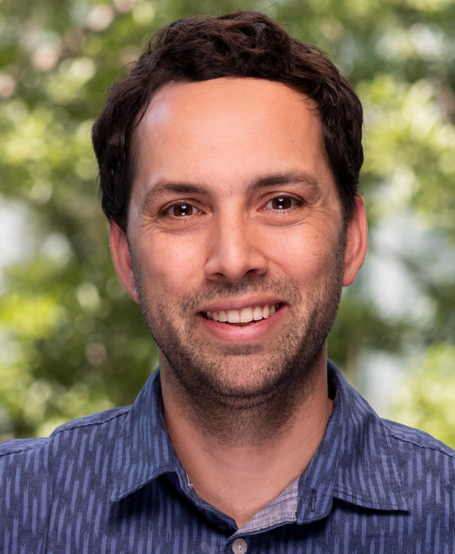

 

## Affiliations

* *Assistant Professor* in the [Department of Computer Science](http://www.dcc.uchile.cl) at the [University of Chile](http://www.uchile.cl/). 
* *Principal Researcher* at [National Center for Artificial Intelligence Research (CENIA)](https://www.cenia.cl) (Funded by Programa Centros Basales, ANID, Chile). 
* *Young Researcher* at [Millennium Institute for Foundational Research on Data (IMFD)](http://www.imfd.cl) (Funded by Programa Milenio, ANID, Chile). 
* Member of  the [Data and Artificial Intelligence Initiative (ID&IA)](https://idia.uchile.cl), Faculty of Physical and Mathematical Sciences (FCFM), University of Chile.
* *Honorary Research Associate* in the [Machine Learning Group](http://www.cs.waikato.ac.nz/ml/) at the [University of Waikato](http://www.waikato.ac.nz/) in New Zealand (Aotearoa). This is the lab were I did my PhD under the supervision of [Bernhard Pfahringer](https://www.cs.waikato.ac.nz/~bernhard/) and [Eibe Frank](http://www.cs.waikato.ac.nz/~eibe/). 
* *Founding Member* of the [Representations for Learning and Language (ReLeLa)](https://relela.com) research group at [DCC](http://www.dcc.uchile.cl) Uchile. 
* *Associate Member* in the [Te Ipu o te Mahara, The Artificial Intelligence Institute at the University of Waikato.](https://ai.waikato.ac.nz/home)

## Research Areas

My research interests and expertise lie in the acquisition of knowledge and information from unstructured data, particularly natural language text, spanning the following overlapping fields:

* [Natural language processing](https://en.wikipedia.org/wiki/Natural_language_processing)
* [Data mining](https://en.wikipedia.org/wiki/Data_mining)
* [Data science](https://en.wikipedia.org/wiki/Data_science)
* [Machine learning](https://en.wikipedia.org/wiki/Machine_learning)
* [Information retrieval](https://en.wikipedia.org/wiki/Information_Retrieval)
* [Social media analytics](https://en.wikipedia.org/wiki/Social_media_analytics)
* [Computational social science](https://en.wikipedia.org/wiki/Computational_social_science)
* [Artificial Intelligence](https://en.wikipedia.org/wiki/Artificial_intelligence)
* [Statistics](https://en.wikipedia.org/wiki/Statistics)

## Contact

*  Avenida Beauchef 851, of. 304, Piso 3, Edificio Norte, Santiago, Chile / C.P. 837-0456
*  Phone number: +56 2 2978 4974
*  Email : fbravo at dcc.uchile.cl

## Other Profiles

* [DCC Uchile](https://www.dcc.uchile.cl/nosotros/academico/fbravo#titulo)
* [FCFM Uchile](http://ingenieria.uchile.cl/sobre-la-fcfm/organizacion/personas/cuerpo-academico/ciencias-de-la-computacion?qui_id=121)
* [IMFD](https://imfd.cl/en/investigador/felipe-bravo-marquez/)
* [Uchile](http://www.uchile.cl/portafolio-academico/perfilAcademico.jsf?username=felipebravom)
* [Google Scholar](https://scholar.google.com/citations?user=q--XWcQAAAAJ&hl)
* [GitHub](https://github.com/felipebravom)
* [DBLP](https://dblp.org/pid/04/8612.html)
* [Linkedin](https://www.linkedin.com/in/felipebravomarquez)
* [ResearchGate](https://www.researchgate.net/profile/Felipe_Bravo-Marquez/)
* [Scopus](https://www.scopus.com/authid/detail.uri?origin=resultslist&authorId=36627971200)
* [Semantic Scholar](https://www.semanticscholar.org/author/Felipe-Bravo-Marquez/2998375)
* [Web of Science](https://www.webofscience.com/wos/author/record/1907195)
* [Orcid](https://orcid.org/0000-0002-2153-4306)
* [ACL Anthology](https://aclanthology.org/people/f/felipe-bravo-marquez/)
* [Youtube](https://www.youtube.com/user/felipebravom)
* [Twitter](https://twitter.com/felipebravom)

Last Updated March 1st, 2024 
